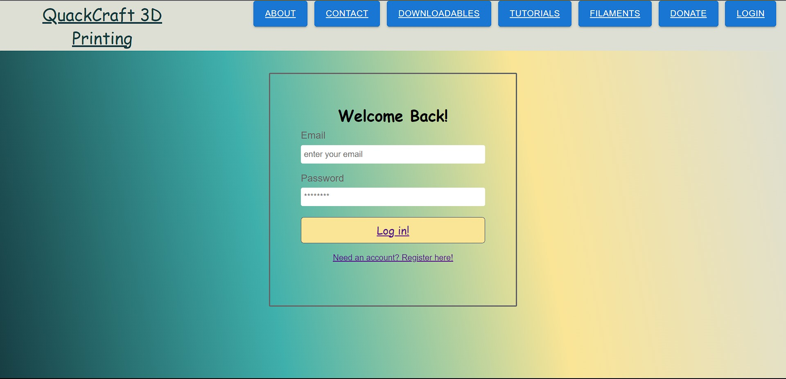
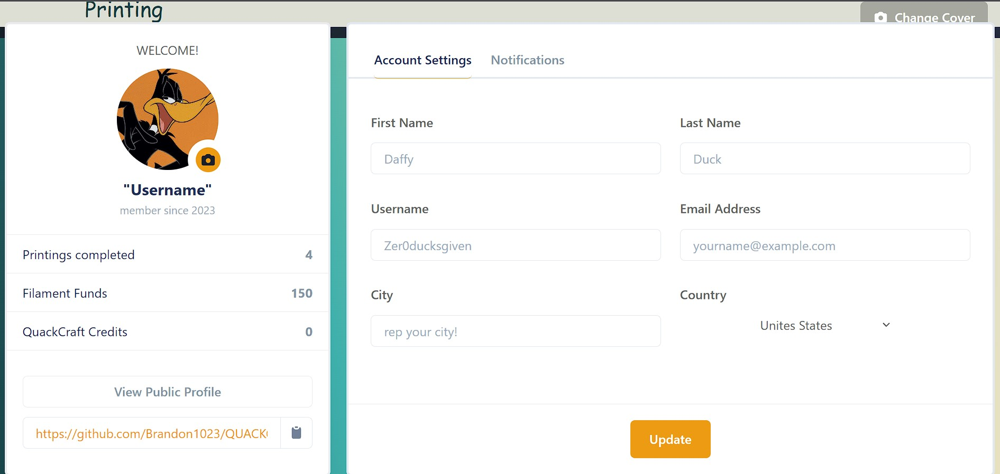
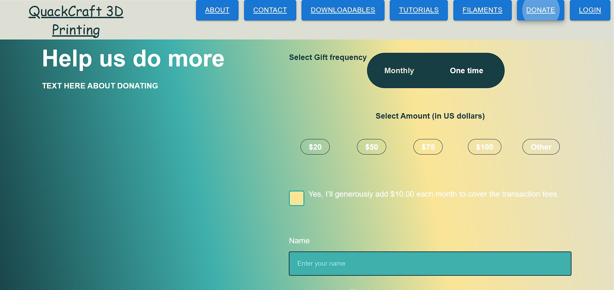

# ZERO-DUCKS-GIVEN

## Description

This is a 3D priniting related application.  The motiviation behind building this project was to create a centralized application for 3D Printing needs.  The application is intended to allow users access to tutorials, downloadable print files, Filament information, and for future development social interactions and scoring.  In building this application the we were able to work on honing our skills with REACT, and back end technologies.

## Table of Contents

- [Technologies](#technologies)
- [Installation](#installation)
- [Usage](#usage)
- [Credits](credits)
- [License](#license)
- [Questions](#questions)

## Technologies:
- JavaScript
- MongoDB
- ExpressJS
- React
- NodeJS
- Material UI
- Chakara UI

## Installation:

## Usage:
To use the application the user will go to the deployment link and then register with an account if they do not have one.  Once the user has created an account the user is able to then login and view their user profile.  The user then has access to the other areas of the site.  The user is able to look at tutorials, check out downloadble files, and see the requirement for printer filament types.

- [Click here to view the Repository URL](https://github.com/Brandonk1023/ZERO-DUCKS-GIVEN)
- [Click here to view the Deployed URL]() //EDIT THIS

## Credits:
- Raiya Young (Front-end)
- Brandon Kilgore (Back-end/Front-End/Repo-Owner)
- Lillian Hughes (Back-end)
- CJ (TA)

Material UI Documentation:
https://mui.com/

Chakara UI Documentaition:
https://chakra-ui.com/

Heroku Documentation:
https://devcenter.heroku.com/categories/reference

## License:
This project is covered by an MIT license.

## Questions:

If you have questions about this repo, have an issue, or  need to contact the developers directly. Please reach out using the links below. [Bundleofcodes](https://github.com/bundleofcodes)
[Brandon1023](https://github.com/brandon1023)
[lillianlaihughes](https://github.com/lillianlaihughes)

